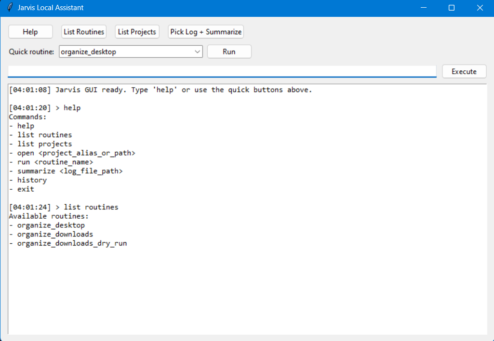
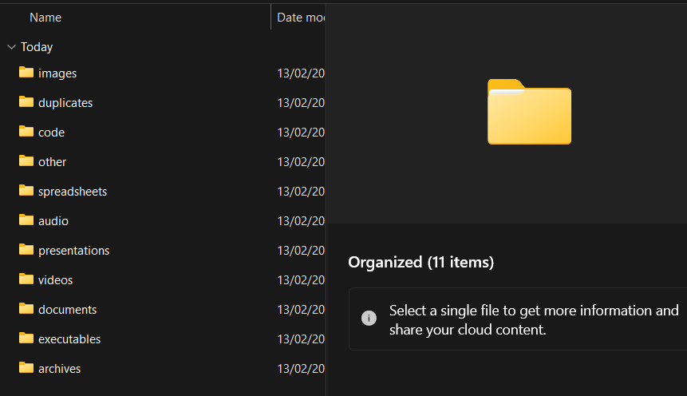

# Smart File Organizer + Jarvis GUI

Local automation toolkit for Windows:
- `main.py`: smart file organizer with duplicate detection
- `jarvis.py`: desktop GUI assistant for running routines, opening folders, and summarizing logs

## Why This Project

Manual file cleanup gets messy fast. This toolchain gives you:
- clean folder structures
- repeatable automation routines
- a local GUI assistant to run workflows quickly

## Jarvis GUI Preview




## Organizer Output Preview



## Core Features

### File Organizer (`main.py`)

- Sort by file category (`images`, `videos`, `documents`, `code`, etc.)
- Sort mode options:
- `date`: groups by month bucket (`YYYY-MM`)
- `source`: groups by workflow/source bucket (`screenshots`, `whatsapp`, `telegram`, `browser_downloads`, etc.)
- Duplicate detection with SHA-256
- Duplicate routing to `duplicates/` (no deletion by default)
- Safe filename collision handling (`name (1).ext`)
- Dry-run support
- Continuous watch mode

### Jarvis Assistant (`jarvis.py`)

- Desktop GUI with quick action buttons
- Routine runner from dropdown or command input
- Folder opening in File Explorer
- Log summarization (error/warning pattern extraction)
- Command history logging
- Optional CLI mode for terminal use

## Project Structure

```text
.
|-- main.py
|-- jarvis.py
|-- jarvis_config.json
|-- README.md
`-- docs/
    `-- images/
        `-- .gitkeep
```

## Quick Start

### 1. Requirements

- Python 3.9+ (Windows)
- No third-party dependencies required

### 2. Run Organizer

```powershell
python main.py --source "%USERPROFILE%\Downloads" --destination "%USERPROFILE%\Downloads\Organized"
```

Dry run:

```powershell
python main.py --source "%USERPROFILE%\Downloads" --destination "%USERPROFILE%\Downloads\Organized" --dry-run
```

Sort by source/workflow:

```powershell
python main.py --source "%USERPROFILE%\Downloads" --destination "%USERPROFILE%\Downloads\Organized" --sort-mode source
```

Watch mode:

```powershell
python main.py --source "%USERPROFILE%\Desktop" --destination "%USERPROFILE%\Desktop\Organized" --watch --interval 20
```

### 3. Run Jarvis GUI

```powershell
python jarvis.py
```

CLI mode:

```powershell
python jarvis.py --cli
```

One-shot command mode:

```powershell
python jarvis.py --once "list routines"
python jarvis.py --once "organize_downloads_dry_run"
python jarvis.py --once "summarize C:\path\to\app.log"
```

## Jarvis Commands

- `help`
- `list routines`
- `list projects`
- `open <project_alias_or_path>`
- `run <routine_name>`
- `summarize <log_file_path>`
- `history`

Direct routine invocation is also supported:
- `organize_desktop`
- `organize_downloads`
- `organize_downloads_dry_run`

## Config

Edit `jarvis_config.json`:
- `open_mode`: `explorer` (default) or `vscode`
- `projects`: aliases for `open <alias>`
- `routines`: shell commands callable by name

## Notes

- Organizer index path: `<destination>/.organizer_index.json`
- Stop watch mode with `Ctrl+C`
- Use `--non-recursive` to process only top-level files
- Duplicates are moved, not deleted, unless you add custom logic
